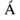
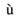

# XML 字符实体

本章介绍了 XML __字符实体__。在我们学习字符实体之前，先了解一下什么是 XML 实体。

[W3 Consortium](http://www.w3.org/TR/REC-xml/#dt-docent) 中对实体的定义如下：

> 文档实体作为实体树的根元素和 XML 处理程序的起点。

这意味着实体就是 XML 中的占位符。它们可以声明在文档序言或者DTD中。实体有不同的类型，本章后面会讨论字符实体。

HTML 和 XML 都有一些符号被保留使用，它们不能在 XML 代码中用作内容。例如，&lt; 和 &gt; 符号被用作 XML 标签的开头和结尾。要显示这些特殊字符，就要使用字符实体。

有些特殊的字符或符号还不能直接使用键盘输入。可以使用字符实体来显示这些符号或特殊字符。

## 字符实体类型

下面是字符实体类型：

- 预定义的字符实体。
- 编码字符实体。
- 命名字符实体。

### 预定义的字符实体

引入它们是为了避免使用某些有歧义的符号。例如，当我们把小于(<)或大于(>)符号当尖括号(<>)使用时就会产生歧义。字符实体从根本上来说就是用来界定 XML 标签的。下面是一个来自 XML 规范的预定义字符实体列表。它们可以用来表示不带歧义的字符。

- 和号: &amp;
- 单引号: &apos;
- 大于: &gt;
- 小于: &lt;
- 双引号: &quot;

### 数字字符实体

数字引用被用来表示字符实体。数字引用可以是十进制或十六进制格式。由于有数以千记的数字引用，导致很难记住它们。数字引用通过字符在 Unicode 字符集中的编码数值来表示。

十进制数字引用基本语法：

```xml
&# decimal number ;
```

十六进制数字引用基本语法：

```xml
&#x Hexadecimal number ;
```

下面的表格列出了一些预定义字符实体和它们对应的数值：

<table>
	<thead>
		<tr>
			<th>实体名称</th>
			<th>字符</th>
			<th>十进制引用</th>
			<th>十六进制引用</th>
		</tr>
	</thead>
	<tbody>
		<tr>
			<td>quot</td>
			<td>"</td>
			<td>&amp;#34;</td>
			<td>&amp;#x22;</td>
		</tr>
		<tr>
			<td>amp</td>
			<td>&</td>
			<td>&amp;#38;</td>
			<td>&amp;#x26;</td>
		</tr>
		<tr>
			<td>apos</td>
			<td>'</td>
			<td>&amp;#39;</td>
			<td>&amp;#x27;</td>
		</tr>
		<tr>
			<td>lt</td>
			<td><</td>
			<td>&amp;#60;</td>
			<td>&amp;#x3C;</td>
		</tr>
		<tr>
			<td>gt</td>
			<td>></td>
			<td>&amp;#62;</td>
			<td>&amp;#x3E;</td>
		</tr>
	</tbody>
</table>

### 命名字符实体

正如数值字符很难记住，最受欢迎的字符实体类型是命名字符实体。因为每个实体都用一个名称标识。

例如：

- 'Aacute' 表示带重音符的大写  字符。
- 'ugrave' 表示带沉音符的小写 。