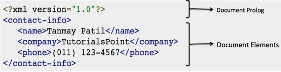

# XML 文档

一个 XML _文档_ 就是一个由元素和其他标记按照有序的计划组成的基本 XML 信息单元。一个 XML _文档_可以包含各种各样的数据。比如，数字，数字表示分子结构或数学公式的数据库。

## XML 文档示例

下面提供了一个简单的 XML 文档示例：

```xml
<?xml version="1.0"?>
<contact-info>
	<name>Tanmay Patil</name>
	<company>TutorialsPoint</company>
	<phone>(011) 123-4567</phone>
</contact-info>
```

下图描述了 XML 文档部分。



## 文档序言

__文档序言__ 在文档的顶部，根元素之前。这部分包含：

- XML 声明
- 文档类型声明

可以在 [XML 声明](xml_declaration.md) 中学习更多关于 XML 声明的内容。

## 文档元素

__文档元素__ 就是 XML 构建块。它们把文档分割为一个层级结构，每一级都有不同的目的。我们可以把一个文档分割为多个部分，因此它们可以以不同的方式渲染或者让搜索引擎使用。元素可以是一个组合文本和其他元素的容器。

在 [XML 元素](xml_elements.md) 中可以学习更多关于 XML 元素的内容。