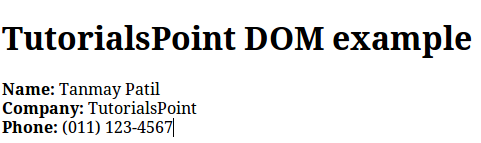

# XML 文档对象模型

文档对象模型（DOM）是 XML 的基础。XML 文档有一个表达文档信息结构层次的单位，被称作_节点_；DOM 是描述这些节点和它们之间关系的一种方式。

DOM 文档就是一个节点集合或者按照层次结构组织的信息块。这个层次结构允许开发人员导航这个节点数来查询特定的信息。由于它基于信息结构层次，DOM 也被认为是_基于节点树_的。

另一方面，XML DOM 开提供了一个 API，允许开发在节点数的任意位置添加，编辑，移动或者移除节点，以便创建应用程序。

## 示例

下面的示例（sample.htm）将一个 XML 文档（"address.xml"）解析为一个 XML DOM 对象，然后用 JavaScript 提取了一些信息：

```html
<!DOCTYPE html>
<html>
<body>
<h1>TutorialsPoint DOM example </h1>
<div>
<b>Name:</b> <span id="name"></span><br>
<b>Company:</b> <span id="company"></span><br>
<b>Phone:</b> <span id="phone"></span>
</div>
<script>
if (window.XMLHttpRequest) {// code for IE7+, Firefox, Chrome, Opera, Safari
	xmlhttp = new XMLHttpRequest();
} else {// code for IE6, IE5
	xmlhttp = new ActiveXObject("Microsoft.XMLHTTP");
}

xmlhttp.open("GET","/xml/address.xml",false);
xmlhttp.send();
xmlDoc=xmlhttp.responseXML;
document.getElementById("name").innerHTML=
xmlDoc.getElementsByTagName("name")[0].childNodes[0].nodeValue;
document.getElementById("company").innerHTML=
xmlDoc.getElementsByTagName("company")[0].childNodes[0].nodeValue;
document.getElementById("phone").innerHTML=
xmlDoc.getElementsByTagName("phone")[0].childNodes[0].nodeValue;
</script>
</body
</html>
```

__address.xml__ 的内容如下：

```xml
<?xml version="1.0"?>
<contact-info>
	<name>Tanmay Patil</name>
	<company>TutorialsPoint</company>
	<phone>(011) 123-4567</phone>
</contact-info>
```

我们可以把这两个文 __sample.htm__ 和 __address.xml__ 件保存到同一目录 __/xml__ 中，然后通过在浏览器中打开的方式执行 __sample.htm__ 文件。它应该生成如下所示结果：



这里，可以看到我们提取了每个子节点并显示了它们的值。