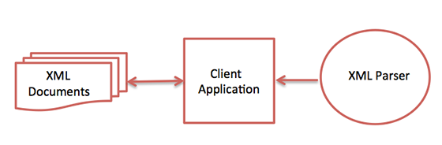

# XML 解析器

XML 解析器是一个软件库或者是一个为客户端应用程序使用 XML 文档提供结构的程序包。它会适当的检查 XML 文档的格式，还会验证 XML 文档。现代浏览器都有内置的 XML 解析器。

下图展示了 XML 解析器如何与 XML 文档交互：

解析器的目标是把 XML 转换为可读的代码。

为了缓解解析过程，还可以使用一些商业产品促进 XML 文档分解以便生成更可靠的结果。

下面列出了一些常用的解析器：

- __MSXML（Microsoft Core XML Services）：__ 这是一组来自微软的标准 XML 工具，包括一个解析器。
- __System.Xml.XmlDocument：__ 这个类是 .NET 库的一部分，其中包含很多 XML 相关的不同的类。
- __Java 内置解析器：__ Java 库有自己的解析器。这个库被设计为我们可以使用外部实现比如来自 Apache 的 Xerces 或者 Saxon 替换内置解析器。
_ __Saxon：__ Saxon 提供了解析，转换和查询 XML 的工具。
- __Xerces：__ Xerces 是用 Java 实现的，它由著名的开源组织 Apache 软件基金会开发。