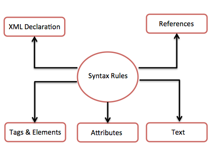

# XML 语法

本章会带你通过简单的语法规则编写一个 XML 文档。下面是一个完整的 XML 文档：

```xml
<?xml version="1.0"?>
<concat-info>
<name>Tanmay Patil</name>
<company>TutorialsPoint</company>
<phone>(011) 123-4567</phone>
</concat-info>
```

你可以注意要上面的例子中有两种类型的信息：

- 标记，比如 _`<concat-info>`_。
- 文本或者字符数据，比如 _Tutorials Point_和_(011) 123-4567_。

下图描述了在 XML 文档中编写不同类型标记和文本的语法规则：



我们来详细看看上图中的每个组成部分：

## XML 声明

XML 文档可以有一个可选的 XML 声明。它可以写作如下形式：

```xml
<?xml version="1.0" encoding="UTF-8"?>
```

这里 _version_ 就是 XML 版本，_encoding_ 指定文档中的字符编码。

### XML 声明的语法规则

- XML 声明区分大小写，必须以 "<?xml>" 开头并且 "xml" 是小写的。
- 如果文档包含 XML 声明，那么它必须是 XML 文档的第一条语句。
- XML 声明必须是 XML 文档的第一条语句。
- 可以使用一个 HTTP 协议覆盖 XML 声明中指定的 _encoding_ 的值。

## 标签和元素

XML 文件的结构由几个 XML 元素组成，也叫做 XML 节点或 XML 标签。XML 元素的名称使用尖括号 `< >` 闭合，如下所示：

```xml
<element>
```

### 标签和元素的语法规则

__元素语法：__ 每个 XML 元素都需要使用起始和结束元素闭合，如下所示：

```xml
<element>....</element>
```

或者简写形式，就像这样：

```xml
<element/>
```

__元素嵌套：__ 一个 XML 元素可以包含多个 XML 元素作为它的子元素，但是子元素不能重叠。比如，一个元素的结束标签必须与最近匹配的开始标签具有相同的名称。

下面的例子展示了不正确的嵌套标签：

```xml
<?xml version="1.0"?>
<contact-info>
<company>TutorialsPoint
<contact-info>
</company>
```

下面的例子展示了正确的嵌套标签：

```xml
<?xml version="1.0"?>
<contact-info>
<company>TutorialsPoint</company>
<contact-info>
```

__根元素：__ 一个 XML 文档只有一个根元素。例如，下面不是一个正确的 XML 文档，因为 x 和 y 元素出现在顶层而没有一个根元素：

```xml
<x>...</x>
<y>...</y>
```

下面的例子展示了正确形式的 XML 文档：

```xml
<root>
	<x>...</x>
	<y>...</y>
</root>
```

__区分大小写：__ XML 元素的名称区分大小写。这意味着元素的起始和结束标签大小写必须一样。

例如 __`<contact-info>`__ 和 __`<Contact-Info>` 就不同。

## 属性

__attribute__ 使用名/值对给元素指定一个属性（property）。一个 XML 元素可以有一个或多个属性（attributes）。例如：

```xml
<a href="http://www.tutorialspoint.com/">Tutorialspoint!</a>
```

这里 _href_ 就是属性名称，而 _http://www.tutorialspoint.com/_ 就是属性值。

### XML 属性的语法规则

- XML 属性名区分大小写（和 HTML 不一样）。也就是说 _HREF_ 和 _href_ 会被认为是两个不同的 XML 属性。
- 在语法中相同的属性不能有两个。下面的例子展示了不正确的语法，因为属性 _b_ 被指定了两次：

```xml
<a b="x" c="y" b="z">....</a>
```

- 属性名定义不带引号标记，而属性值必须显示在引号标记中。下面的例子演示了不正确的 XML 语法：

```xml
<a b=x>....</a>
```

在上面的语法中，属性值没有定义在引号标记中。

## XML 引用

_引用_ 通常允许我们在 XML 文档中添加或包含附加的文本。引用使用以符号 __"&"__ 开始，这是一个保留字符，以符号 __";"__ 结尾。XML 中有两种类型的引用：

__实体引用：__ 一个实体引用的起始和结束定界符之间包含一个名称。比如 __`&amp;`__，其中 _amp_ 就是名称。这个 _name_ 通常指向一个预定义的文本字符串或标记。

__字符引用：__ 这些包含引用比如 __`&#65;`__ 包含一个 hash 标记（"#"），后面紧跟一个数字。这个数字时钟指向一个字符的 Unicode 码。在这里，65 指向字母 "A"。

## XML 文本

- XML 元素和 XML 属性的名称区分大小写。这意味着元素的开始和结束标签大小写必须一致。
- 为了避免字符编码的问题，所有的 XML 文件都应该保存为 Unicode UTF-8 或者 UTF-16 文件。
- 空白字符，比如 XML 元素和 XML 属性之间的空格，制表符和换行符会被忽略。
- 有些字符是 XML 语法本身保留的。因此，不能直接使用它们，要使用它们，就要使用一些提到实体。下面列出了一些：

<table>
	<thead>
		<tr>
			<th>不允许使用的字符</th>
			<th>替代实体</th>
			<th>字符描述</th>
		</tr>
	</thead>
	<tbody>
		<tr>
			<td><</td>
			<td>&amp;lt;</td>
			<td>小于号</td>
		</tr>
		<tr>
			<td>></td>
			<td>&amp;gt;</td>
			<td>大于号</td>
		</tr>
		<tr>
			<td>&</td>
			<td>&amp;amp;</td>
			<td>和号</td>
		</tr>
		<tr>
			<td>'</td>
			<td>&amp;apos;</td>
			<td>撇号</td>
		</tr>
		<tr>
			<td>"</td>
			<td>&amp;quot;</td>
			<td>双引号</td>
		</tr>
	</tbody>
</table>