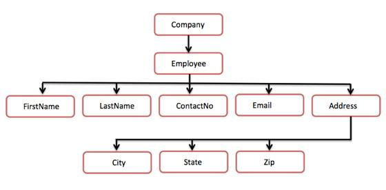

# XML 树结构

XML 文档始终是描述性的。树状结构通常被称为 XML 树，它在描述 XML 文档的过程中扮演一个重要的角色。

这个树结构包含根（父）元素，子元素等等。通过使用树状结构，我们可以了解源自根元素的所有后续分支和子分支。解析从根元素开始，然后向下移动到指向某个元素的第一个分支，从这里开始处理第一个分支及其子节点。

## 示例

下面的示例演示了简单的 XML 树结构：

```
<?xml version="1.0"?>
<Company>
	<Employee>
		<FirstName>Tanmay</FirstName>
		<LastName>Patil</LastName>
		<ContactNo>1234567890</ContactNo>
		<Email>tanmaypatil@xyz.com</Email>
		<Address>
			<City>Bangalore</City>
			<State>Karnataka</State>
			<Zip>560212</Zip>
		</Address>
	</Employee>
</Company>
```

下面的树结构表示上面的 XML 文档：



上图中，有一个叫做 `<company>` 的根元素。里面又有一个 `<Employee>` 元素。在雇员元素里面，又有 5 个分支，分别是 `<FirstName>`，`<LastName>`，`<ContactNo>`，`<Email>` 和 `<Address>`。在 `<Address>` 元素内，又有三个子分支，分别是 `<City>`，`<State>` 和 `<Zip>`。