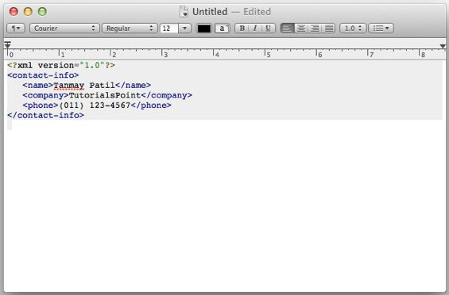
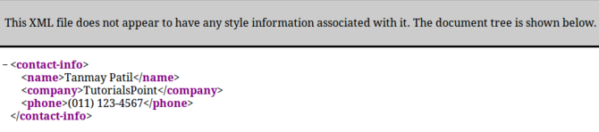
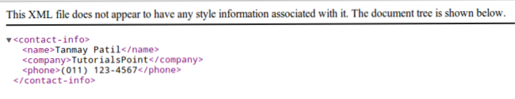
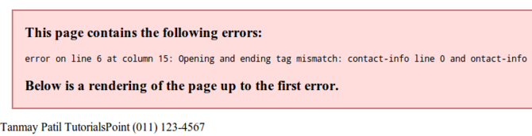

# XML 阅读器

本章介绍了各种查看 XML 文档的方法。可以使用简单的文本编辑器或者任意浏览器查看 XML 文档。大多数主流浏览器都支持 XML。可以通过双击 XML 文档（如果是一个本地文件）或者在地址栏输入 URL 路径（如果文件位于服务器上）的方式在浏览器中打开 XML 文件，也可以以同样的方式在浏览器中打开其他文件。XML 文件被保存为 __".xml"__ 扩展。

接下来让我们来探索一下可以查看 XML 文件的各种方法。下面这个示例（sample.xml）适用于本章所有章节。

```
<?xml version="1.0"?>
<contact-info>
	<name>Tanmay Patil</name>
	<company>TutorialsPoint</company>
	<phone>(011) 123-4567</phone>
</contact-info>
```

## 文本编辑器

任何简单的文本编辑器，比如 Notepad，Textpad 或者 TextEdit 都可以用来创建或查看一个 XML 文档，如下所示：



## FireFox 浏览器

双击文件在 FireFox 中打开上面的 XML，它会显示高亮的 XML 代码，这让代码更可读。它还在 XML 元素的左侧显示了一个加号（+）和减号（-）。当我们点击减号（-）时它会隐藏代码，点击加号（+）时代码会展开。在 FireFox 中的输出如下所示：



## Chrome 浏览器

在 Chrome 浏览器中打开上面的 XML 代码。代码被显示为如下形式：



## XML 文档中的错误

如果我们的 XML 代码中缺失某些标签，浏览器中会显示一个消息。我们可以尝试在 Chrome 中打开下面的 XML 文件。

```
<?xml version="1.0"?>
<contact-info>
	<name>Tanmay Patil</name>
	<company>TutorialsPoint</company>
	<phone>(011) 123-4567</phone>
</ontact-info>
```

上面的代码中开始和结束标签不匹配（即 _contact_info_ 标签），因此浏览器会显示一个错误消息，如下所示：

